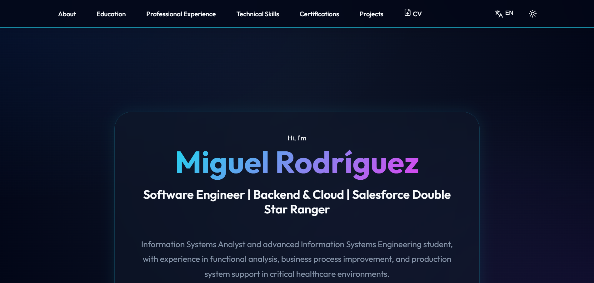

# Miguel Rodríguez - Personal Portfolio 

Este es mi portafolio profesional, diseñado con una estética moderna y de alta tecnología. Está construido para mostrar mi experiencia como Ingeniero en Sistemas, mis proyectos y habilidades técnicas.

## Preview



##  Características

- **Diseño Moderno & Profesional**: Estética de alta tecnología con gradientes limpios, glassmorphism y efectos visuales avanzados.
- **Responsive**: Totalmente adaptado para dispositivos móviles, tablets y escritorio.
- **Sistema Multi-idioma**: Soporte completo para Español e Inglés.
- **Modo Oscuro/Claro**: Selector de tema dinámico con persistencia.
- **Animaciones Premium**: Reveal animations al hacer scroll y hovers interactivos usando Framer Motion.
- **IA-Ready**: Sección dedicada a habilidades en Desarrollo utilizando IA y Prompt Engineering.
- **Secciones Detalladas**:
  - Hero con resumen profesional.
  - Educación con línea de tiempo.
  - Experiencia Laboral con descripciones desplegables (accordion).
  - Habilidades Técnicas con iconos dinámicos.
  - Certificaciones organizadas por categoría.
  - Proyectos con enlaces a repositorios (Frontend/Backend), demos en vivo y presentaciones en video.
  - Formulario de contacto funcional.

## Stack Tecnológico

- **Frontend**: [React](https://reactjs.org/) + [Vite](https://vitejs.dev/)
- **Iconografía**: [Lucide React](https://lucide.dev/)
- **Estilos**: Vanilla CSS3 (Variables, Grid, Flexbox, Animations)
- **Despliegue**: Preparado para Vercel o Netlify.

##  Instalación y Uso Local

1. Clona el repositorio:
   ```bash
   git clone https://github.com/Miguel58000/Portfolio-Miguel-Rodriguez.git
3. Instala las dependencias:
   ```bash
   npm install
   ```
4. Inicia el servidor de desarrollo:
   ```bash
   npm run dev
   ```

##  Historial de Versiones (Changelog)

- **v1.12 (23/04/2026)**: 
  - Optimización y detallado avanzado de arquitecturas técnicas en proyectos clave (Next.js, Prisma, MikroORM, MongoDB).
  - Mejora de descripciones para resaltar el valor técnico y profesional de cada proyecto.
  - Sincronización integral de habilidades técnicas con el stack de los proyectos.
  - Adición de acceso directo a **Contacto** en el navbar y menú móvil.
- **v1.11 (23/04/2026)**: 
  - **Refinamiento Mobile**: Ajuste integral de paddings, tamaños de fuente y alineaciones para una experiencia móvil de alta calidad.
  - Refactorización de espaciados y migración de estilos inline a CSS para mayor simetría y mantenibilidad.
- **v1.10 (23/04/2026)**: 
  - Integración completa de **Framer Motion** para animaciones de scroll y transiciones.
  - Implementación de **Menú Hamburguesa** responsivo para mobile.
  - Optimización de descarga de CV: detección automática de idioma y modal de confirmación.
  - Actualización de contenido: sección de **Desarrollo con IA** y Prompt Engineering.
- **v1.01 (20/04/2026)**: Mejora de footer y visualización de logos.
- **v1.00 (15/04/2026)**: Lanzamiento inicial del portfolio responsivo con soporte bilingüe.

##  Contacto

- **LinkedIn**: [Miguel Rodríguez](https://www.linkedin.com/in/miguel-rodr%C3%ADguez-eis/)
- **GitHub**: [@Miguel58000](https://github.com/Miguel58000)
- **Email**: miguelrodriguezips36@gmail.com
